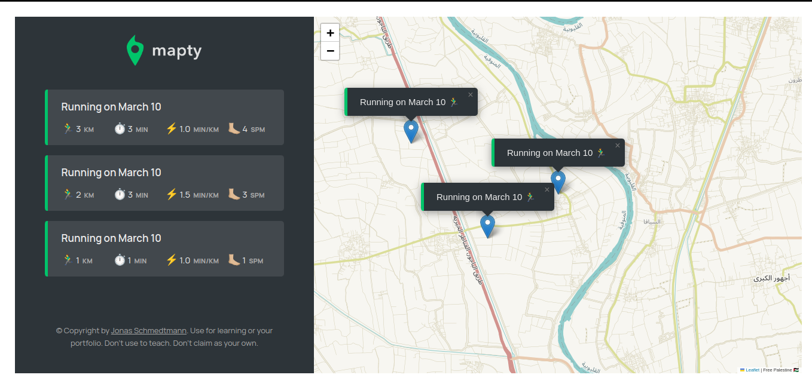

# Mapty

Mapty is a web application that allows users to track their workouts by adding markers to a geographical map. Users can point any location on the map and add a workout, specifying whether it's for cycling or running, along with the duration and distance. After adding a workout, a marker is placed on the map, and the workout is listed on the side. Users can click on a workout in the list to navigate to it on the map.

## Features

- Add workouts to the map by pointing any location.
- Choose between cycling or running workouts.
- Specify the duration and distance for each workout.
- View workouts listed on the side panel.
- Click on a workout in the list to navigate to it on the map.
- Workouts are stored locally using the Local Storage API.

## Project Details

- **Project Name:** Mapty
- **Author:** Islam Sobhy Eladly
- **LinkedIn:** [Islam Sobhy Eladly](https://www.linkedin.com/in/islam-sobhy-eladly/)
- **Live Demo:** [Mapty Live Demo](https://mapty-live-demo.netlify.app/)
- **Demo Image:** 

## Installation

Mapty is a web application and can be accessed directly from the provided live demo link. No installation is required.

## Course Information

This project is one of the projects of the "The Complete JavaScript Course 2024: From Zero to Expert!" by Jonas Schmedtmann. If you're interested in learning more about JavaScript and building real-world projects, you can enroll in the course [here](https://www.udemy.com/course/the-complete-javascript-course/?couponCode=KEEPLEARNING).
